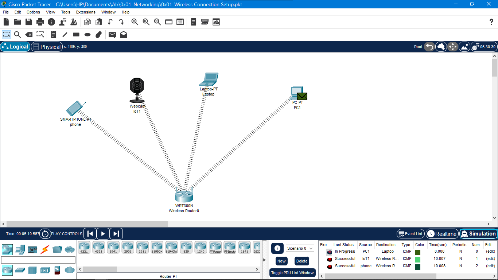
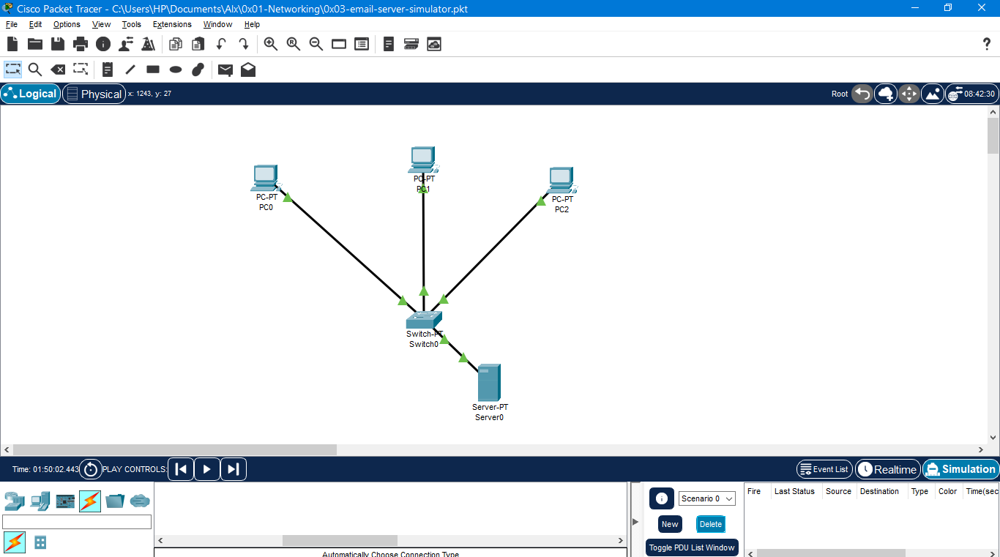

# 0x01-Networking
### `Computer Networking` class, the files above are for **Networking topology** using _Cisco Packet Tracer_.
---
### 0x01-Wireless connection setup
- In this file I configure wireless network topology between a PC, phone, laptop, and webcam in Cisco Packet Tracer.

  

### 0x02-wired-and-wireless connection
- Is a Wired connections that share packets with wireless connections that use one access point in `Cisco Packet Tracer`. 

 
  

  
  ### 0x03-email-server-simulator
  - Is an email server simulation in `Cisco Packet Tracer`.
  

   
  

 
 ## Support

💖 If you like this project, give it a ⭐ and share it with friends!

